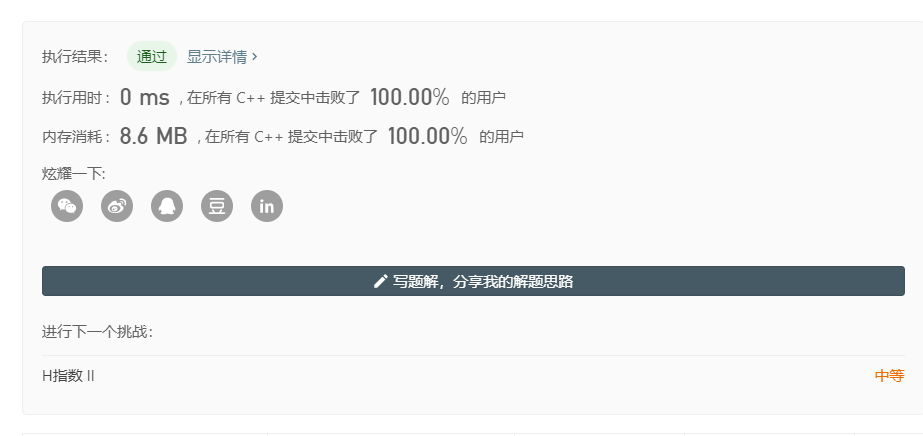

Algo2020 HW5

邮箱：sswu@pku.edu.cn

- 1. 合并区间
  - 链接：https://leetcode-cn.com/problems/merge-intervals/
  
  - 代码：
    ````c++
        class Solution {
        public:
            static int cmp(const vector<int> &aa,const vector<int>&bb){
                return aa[0]<bb[0];
            }
            vector<vector<int>> merge(vector<vector<int>>& intervals) {
                vector<vector<int>>ans;
                if (intervals.size()==0) return ans;
                ans.reserve(intervals.size());
                sort(intervals.begin(),intervals.end(),Solution::cmp);
                vector<int> tmp=intervals[0];
                for (int i=1;i<intervals.size();++i)
                    if (tmp[1] >= intervals[i][0] )
                        tmp[1]=max(tmp[1],intervals[i][1]);
                    else {
                        ans.push_back(tmp);
                        tmp=intervals[i];
                    }
                ans.push_back(tmp);
                return ans;
            }
        };
    ````
    
  - 截图：
  
    
  
  - 思路：按左端点排序后，遍历合并相邻区间。

- 2. 排序链表
  
  - 链接：https://leetcode-cn.com/problems/sort-list/
  
  - 代码（递归）：
    ````c++
        class Solution {
        public:
            ListNode* sortList(ListNode* head) {
                if (head!=NULL&&head->next!=NULL){
                    ListNode *i,*j,*mid;
                    for (i=head,j=head;j->next!=NULL&&j->next->next!=NULL;i=i->next,j=j->next->next);
                    mid=i->next;i->next=NULL;
                    head=sortList(head);
                    mid=sortList(mid);
                    ListNode tmp(0);
                    ListNode *ans=&tmp;
                    while (head!=NULL && mid!=NULL)
                        if (head->val < mid->val)
                            ans->next=head,ans=ans->next,head=head->next;
                        else 
                            ans->next=mid,ans=ans->next,mid=mid->next;
                    if (head!=NULL) ans->next=head;
                    else ans->next=mid;
                    return tmp.next;
                }
                else return head;
            }
        };
    ````
 
   - 代码（非递归）：
    ````c++
        class Solution {
        public:
            ListNode* sortList(ListNode* head) {
                if (head == NULL) return head;
                ListNode tmp(0);
                tmp.next = head;
                for (int step = 1, iters;; step <<= 1) {
                    ListNode *i = tmp.next, *j = tmp.next, *tmphead = &tmp;
                    for (iters = 0;; iters++) {
                        for (int k = 0; j != NULL && k < step; ++k) j = j->next;
                        if (j == NULL) break;
                        int cnta = 0, cntb = 0;
                        while (cnta < step && cntb < step && j != NULL)
                            if (i->val <= j->val)
                                tmphead->next = i, tmphead = i, i = i->next, cnta++;
                            else
                                tmphead->next = j, tmphead = j, j = j->next, cntb++;
                        while (cnta < step)
                            tmphead->next = i, tmphead = i, i = i->next, cnta++;
                        while (cntb < step && j != NULL)
                            tmphead->next = j, tmphead = j, j = j->next, cntb++;
                        tmphead->next = j, i = j;
                    }
                    if (iters == 0) break;
                }
                return tmp.next;
            }
        };
    ````

    
  - 截图：
  
     
 
  - 思路：归并排序。

- 3. H指数
  
  - 链接：https://leetcode-cn.com/problems/h-index/
  
  - 代码：
    ````c++
        class Solution {
        public:
            bool check(int t, int* a, int n) {
                int ans = 0;
                for (int i = 0; i < n; ++i)
                    if (a[i] >= t) ++ans;
                return ans >= t;
            }
            int hIndex(vector<int>& citations) {
                int l = 0, r = citations.size(), ans;
                while (l <= r) {
                    int mid = (l + r) >> 1;
                    if (check(mid, citations.data(), citations.size()))
                        ans = mid, l = mid + 1;
                    else
                        r = mid - 1;
                }
                return ans;
            }
        };
    ````
    
  - 截图：
  
    

  - 思路：显然具有单调性，二分答案即可。
